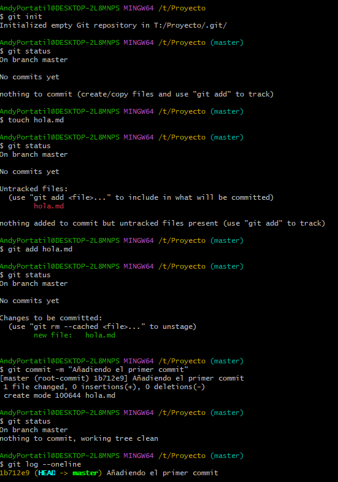
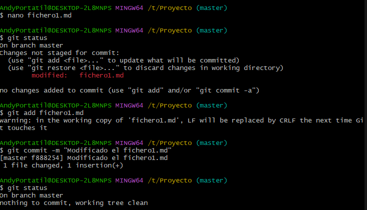
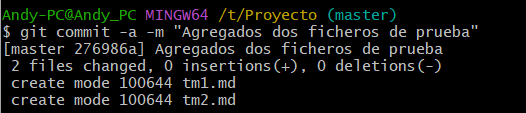
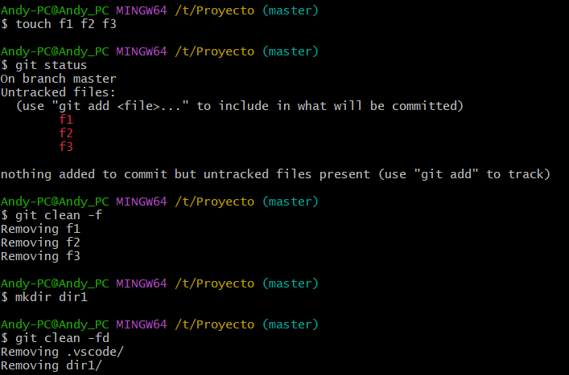

# **TEMA 3 Entornos de desarrollo**

## Sistema de control de versiones distribuido git

---

## **Instalación y procesos (continua entre ejercicios)**

>Mientras vas realizando los diferentes pasos, ve haciendo una pequeña guía en markdown del que consideras más importante, relacionándolo con el apartado de teoría.
Anota en ella los diferentes cambios que vas haciendo sobre tu directorio de trabajo.

***GIT***


Instalación mediante comando

---


Configuración de GIT

---



Creación, inicialización de la carpeta del proyecto y primer commit

---

## **Ejercicio 1**

>Prueba a modificar el fichero y observa los cambios en el estado. En qué estado se encontrará ahora el archivo? Qué tendremos que hacer para que los cambios se reflejen en el repositorio? Investiga sobre el parámetro -a de la orden git commit e intenta relacionarlo con este ejercicio.

La opción `-a` permite hacer un commit de todos los archivos al mismo tiempo



Cambios realizados en el archivo Fichero1.md

---

## **Ejercicio 2**

>Crea dos ficheros, denominados tmp1.md y tmp2.md y añádelos dentro del repositorio, comprobando el estado en cada paso, y verificando que están en el repositorio.




Creación de ambos archivos, comprovación y verificación

---


Eliminación de archivos

---


Cambio de nombre local

---


Cambio de nombre directo desde el repositorio

---


Deshacer cambios

---


Ignorado de ficheros

---



Eliminación de archivos y carpetas no seguidos

---

## **Ejercicio git log y git log --oneline**

>Una vez hayas finalizado, copia como código el resultado de la orden:

`git log`

```log
Andy-PC@Andy_PC MINGW64 /t/Proyecto (master)
$ git log
commit cc06434cd4149daf9c3cae5b3fabf77098fe2f90 (HEAD -> master)
Author: andy <andypr97vlc@gmail.com>
Date:   Mon Oct 28 17:37:16 2024 +0100

    Revert "recuperado archivo tm2.md"

    This reverts commit e4f0296bf13bdee9aa6805d3a94e2612ba8f33c9.

commit 974977d0a2380c4e0053561b121480a4d879e5d3
Author: andy <andypr97vlc@gmail.com>
Date:   Mon Oct 28 17:36:24 2024 +0100

    Eliminado de nuevo tm1.md por equivocacion al recuperarlo

commit a95768eda74d12d23e4671990020cc47da1f8996
Author: andy <andypr97vlc@gmail.com>
Date:   Mon Oct 28 17:33:21 2024 +0100

    Revert "Eliminado tm1.md"

    This reverts commit 67b7d4cf79897f45034faa8ab364a13bf1f0a9db.

commit 21b57a9a827c135e61dd83982a80a932824cda0f
Author: andy <andypr97vlc@gmail.com>
Date:   Mon Oct 28 17:33:01 2024 +0100

    Añadido archivo Java

commit 9302838f40d2a40b7529501872f9fad959c5cee0
Author: andy <andypr97vlc@gmail.com>
Date:   Mon Oct 28 17:13:45 2024 +0100

    Añadido .gitignore

commit 4676e59d4256529f05d5a57c862735865f0ba489
Author: andy <andypr97vlc@gmail.com>
Date:   Mon Oct 28 17:07:50 2024 +0100

    Cambio nombre tmp_mv.md a tmp_mv_2.md

commit f9c0c10fa17554f5a0b4935a473adc8daa575d7a
Author: andy <andypr97vlc@gmail.com>
Date:   Mon Oct 28 17:06:52 2024 +0100

    Creado tmp_mv.md para segundo cambio de nombre

commit e0f2af332e7dc774b8e4f5db408dc2bc079ecb82
Author: andy <andypr97vlc@gmail.com>
Date:   Mon Oct 28 17:04:53 2024 +0100

    Cambio nombre tmp_mv.md

commit 35452ccf40f28caec564056166457d432d01a6a3
Author: andy <andypr97vlc@gmail.com>
Date:   Mon Oct 28 17:02:26 2024 +0100

    tmp_mv.md creado

commit e4f0296bf13bdee9aa6805d3a94e2612ba8f33c9
Author: andy <andypr97vlc@gmail.com>
Date:   Mon Oct 28 16:19:31 2024 +0100

    Eliminado tm2.md

commit 67b7d4cf79897f45034faa8ab364a13bf1f0a9db
Author: andy <andypr97vlc@gmail.com>
Date:   Mon Oct 28 16:18:19 2024 +0100

    Eliminado tm1.md

commit c2ca5e597f32abbfebf6a47044787712c8b1b9d7
Author: andy <andypr97vlc@gmail.com>
Date:   Mon Oct 28 16:14:18 2024 +0100

    Fichero 1 commit proba visual

commit 276986ae780a7b57bf903a7365fa83e3d302f6b0
Author: andy <andypr97vlc@gmail.com>
Date:   Mon Oct 28 15:45:51 2024 +0100

    Agregados dos ficheros de prueba

commit f888254bc3b9927f6d04dc173cba74b780db0774
Author: Andy <andypr97vlc@gmail.com>
Date:   Mon Oct 28 13:52:19 2024 +0100

    Modificado el fichero1.md

commit 31fc770ec670bbbeb40ce89ce90529f8de8b5f01
Author: Andy <andypr97vlc@gmail.com>
Date:   Mon Oct 28 13:50:24 2024 +0100

    Agregado el primer commit

commit 27d4a5fe77c5174fb4b2dadec03c88ea0ff15667
Author: Andy <andypr97vlc@gmail.com>
Date:   Mon Oct 28 13:49:03 2024 +0100

    cambios

commit 1b712e90ed642b7794830dd2112707f975db1bf8
Author: Andy <andypr97vlc@gmail.com>
Date:   Mon Oct 28 13:37:32 2024 +0100

    Añadiendo el primer commit
```

>Y adjunta al final del documento también un pantallazo del resultado de:

`git log --oneline`


