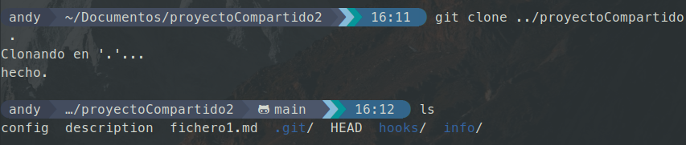
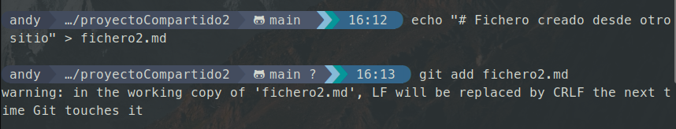
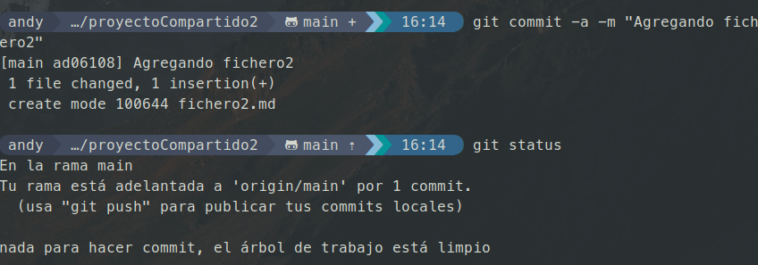
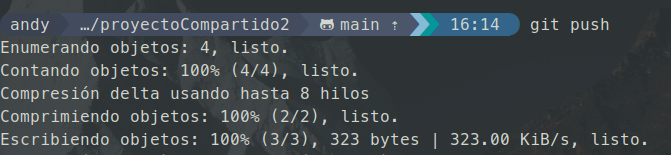

# **TEMA 3 Entornos de desarrollo**

>Clona el repositorio projecteCompartit en tu ordenador, pero guárdalo con el nombre projecteCompartit2. Crea en él un nuevo fichero fitxer2.md con el contenido “Fichero creado desde otro lugar”, añádelo al control de versiones y envíalo al servidor (esto podría hacerse también desde otro ordenador)

    
     
    
     
    
     
    
     <em>Clonado, creacion de ficjero y push hacia la rama main</em> 

