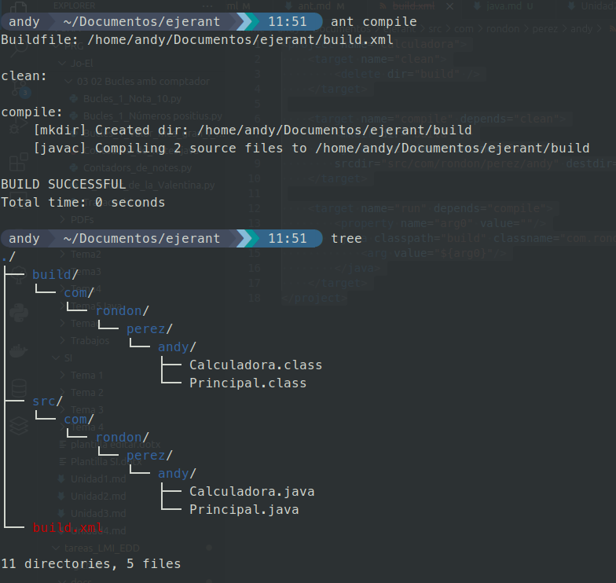
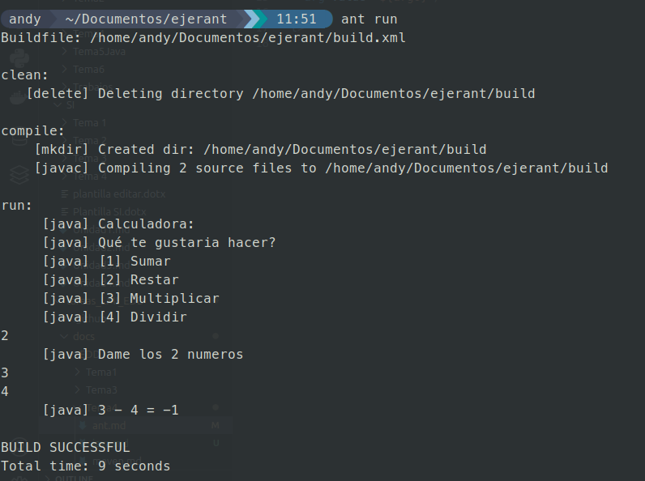

<div style="display: flex; justify-content: center; align-items: center; text-align: center;">
    <h1 style="display: flex; align-items: center;">
        
        <b>TEMA 4 <small>Entornos de desarrollo</small></b>
    </h1>
</div>

---

Con este código creamos el xml para poder ejecutar ANT

```java
<project name="Calculadora">
    <target name="clean">
        <delete dir="build" />
    </target>

    <target name="compile" depends="clean">
        <mkdir dir="build" />
        <javac includeantruntime="false" 
        srcdir="src/com/rondon/perez/andy" destdir="build" />
    </target>

    <target name="run" depends="compile">
        <property name="arg0" value=""/>
        <java classpath="build" classname="com.rondon.perez.andy.Principal">
            <arg value="${arg0}"/>
        </java>
    </target>
</project>
```



Ejecución del comando ant compile y visualización del contenido creado

---



Ejecución del comando ant run