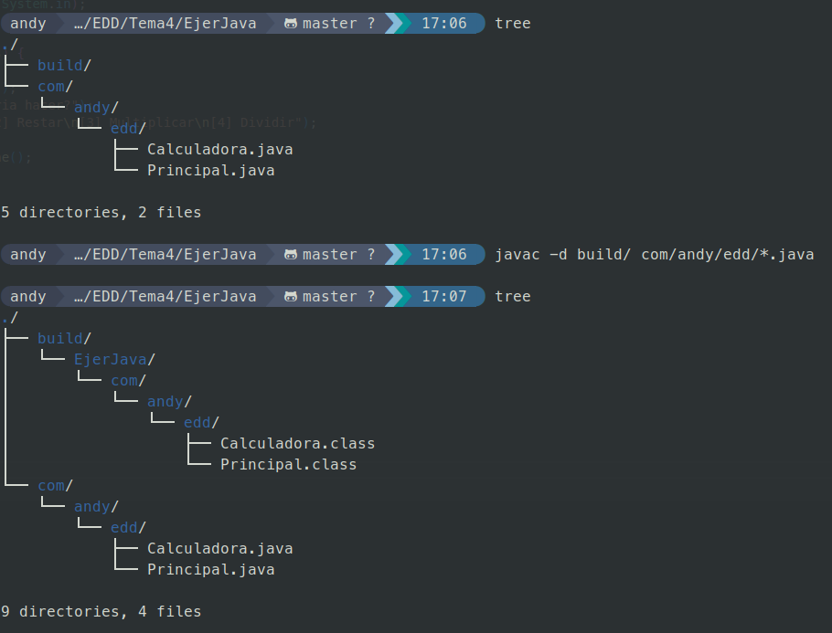

<div style="display: flex; justify-content: center; align-items: center; text-align: center;">
    <h1 style="display: flex; align-items: center;">
        
        <b>TEMA 4 <small>Entornos de desarrollo</small></b>
    </h1>
</div>


>Crea una clase llamada Calculadora en un paquete formado por tu nombre (por ejemplo cómo.jose.edd) con los siguientes métodos (funciones):

>`public static int suma(int a, int b): Que suma a y b y devuelve el resultado,`<br>
>`public static int resto(int a, int b): Que resto a y b y devuelve el resultado,`<br>
>`public static int multiplica(int a, int b): Que multiplica a y b y devuelve el resultado,`<br>
>`public static int divide(int a, int b): Que divide a entre b y devuelve el resultado. Si b es 0, muestra el error y vuelve un 0.`<br>

>Y otra clase que a la función principal haga uso de estas funciones, y muestro los resultados por pantalla.

>Crea el directorio build, y haz uso de este como classpath.

>Indica a un fichero Markdown el proceso que has seguido, incluyendo el código fuente, las órdenes para compilar y para ejecutar, y la estructura de carpetas resultante. Haz una breve explicación de cada cosa.

<p align="center">
    
    <br>
    
    <br><em>Clonado, creacion de fichero y push hacia la rama main</em><br>
</p>

<hr>

Código de la función Principal
```java
package ejerJava.com.andy.edd;

import java.util.*;

public class Principal {

    static Scanner teclado = new Scanner(System.in);

    public static void main(String[] args) {

        System.out.println("Calculadora:");
        System.out.println("Qué te gustaria hacer?");
        System.out.println("[1] Sumar\n[2] Restar\n[3] Multiplicar\n[4] Dividir");

        String eleccion = teclado.nextLine();

        switch (eleccion) {
            case "1":
                Calculadora.sumar();
                break;
            case "2":
                Calculadora.restar();
                break;
            case "3":
                Calculadora.multiplicar();
                break;
            case "4":
                Calculadora.dividir();
                break;
        }

    }
}
```
<hr>

Código de la función Calculadora

```java
package ejerJava.com.andy.edd;

import java.util.*;

public class Calculadora {

    static Scanner teclado = new Scanner(System.in);

    public static int[] pedirNumeros() {

        System.out.println("Dame los 2 numeros");

        int a = teclado.nextInt();
        int b = teclado.nextInt();

        return new int[] { a, b };
    }

    public static void sumar() {
        int[] numeros = pedirNumeros();
        int a = numeros[0];
        int b = numeros[1];
        int resultado = a + b;
        System.out.println(a + " + " + b + " = " + resultado);
    }

    public static void restar() {
        int[] numeros = pedirNumeros();
        int a = numeros[0];
        int b = numeros[1];
        int resultado = a - b;
        System.out.println(a + " - " + b + " = " + resultado);
    }

    public static void multiplicar() {
        int[] numeros = pedirNumeros();
        int a = numeros[0];
        int b = numeros[1];
        int resultado = a * b;
        System.out.println(a + " x " + b + " = " + resultado);
    }

    public static void dividir() {

        int[] numeros = pedirNumeros();
        int a = numeros[0];
        int b = numeros[1];

        if (a == 0 || b == 0) {
            System.out.println("Error, no se puede dividir entre 0");
        } else {
            int resultado = a / b;
            System.out.println(a + " / " + b + " = " + resultado);
        }
    }
}
```