# **TEMA 4 Entornos de desarrollo**

>Sigue los pasos anteriores y configura un proyecto Maven desde la línea de órdenes. Modifica el código fuente con el de tu calculadora. El nombre del paquete será tu nombre y apellidos, en el formato como.cognom2.cognom1.nombre. Documenta el proceso y crea una entrada a tu devlog.

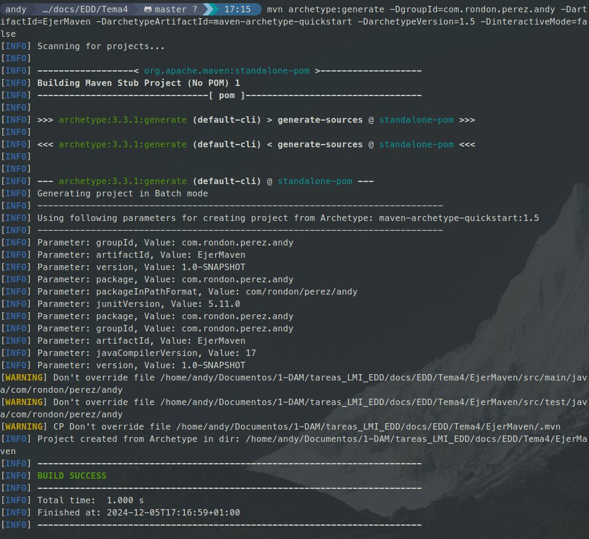

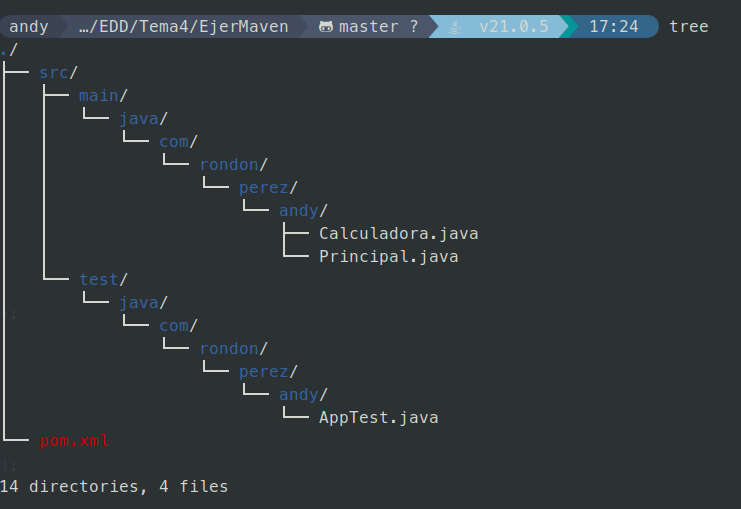

Creación del proyecto a partir del arquetipo y estructura de la carpeta

---

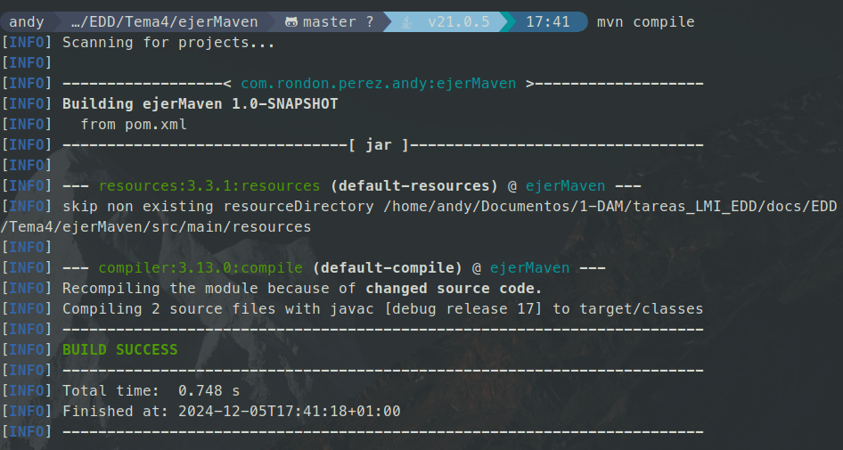

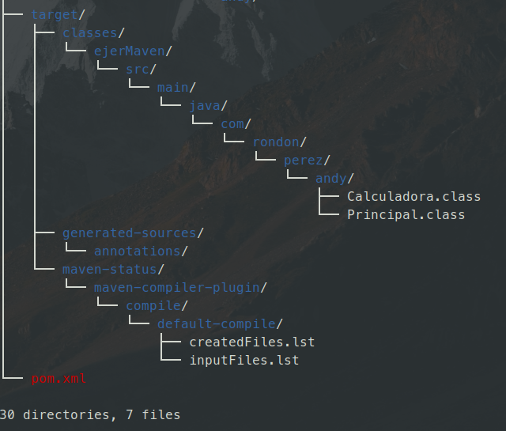

Compilacion, creación del target y estructura de la carpeta

---

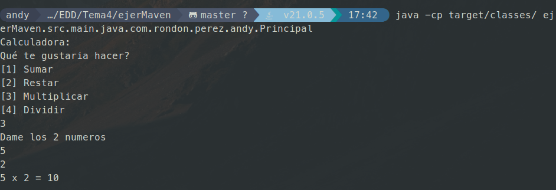

Ejecución desde el target

---

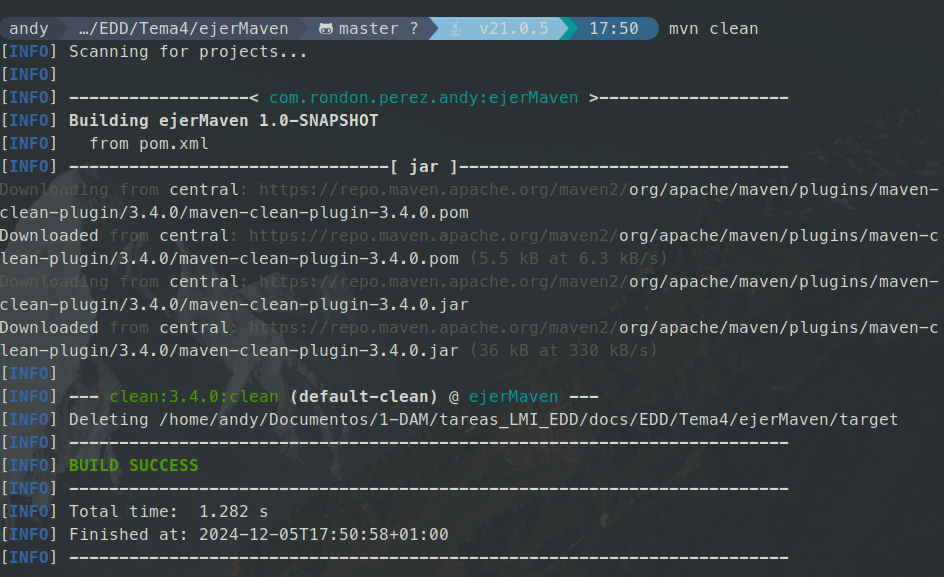

Eliminación del target

---

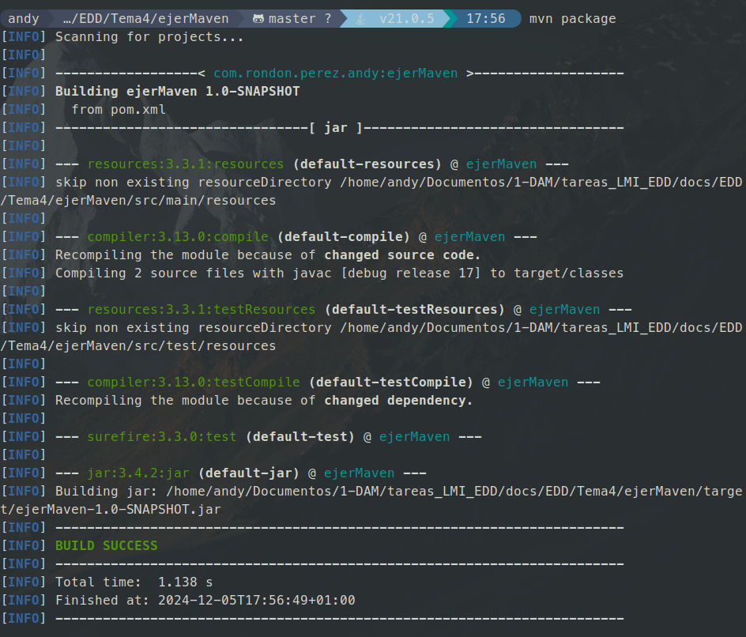

Empaquetado

---

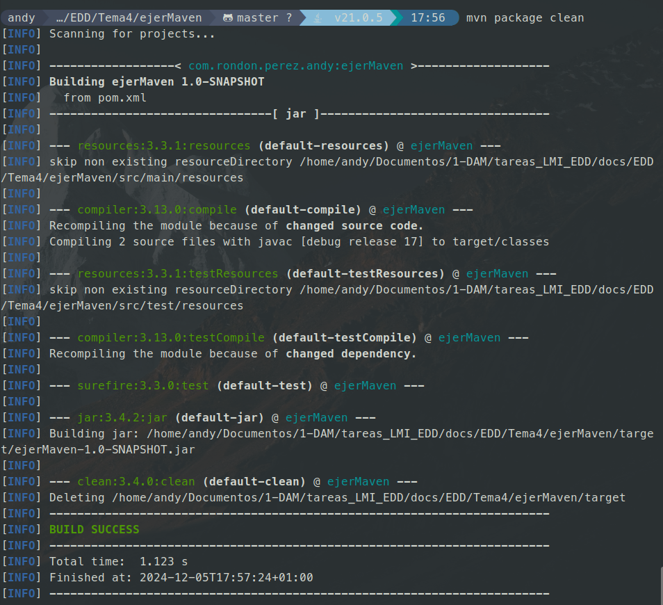

Eliminación del paquete

---

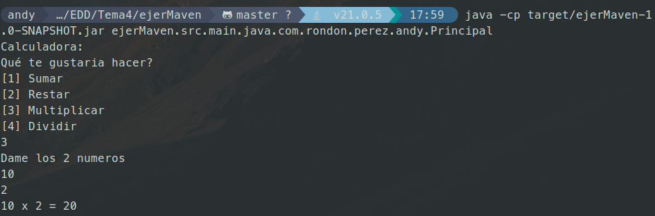

Ejecución desde el paquete

---

>Haz lo mismo, pero ahora generando el proyecto Maven desde VSCode. Documenta el proceso y añádelo en una entrada al devlog.

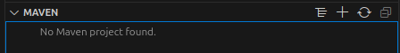

Creación del proyecto maven desde la pestaña

---

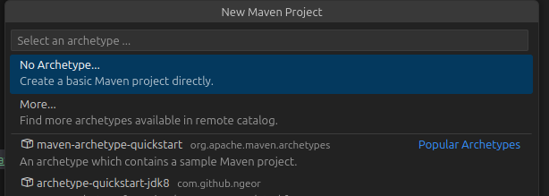

Elección del aquetipo

---

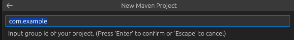

Eleccion de la ruta del proyecto

---

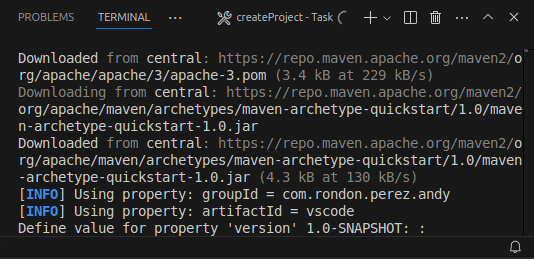

Ejecución desde la terminal de VSCode

---

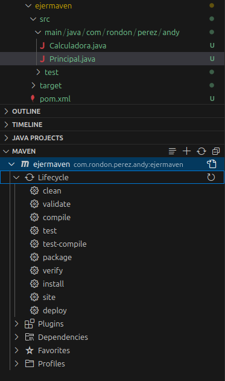

Pestaña con todos los tipos de acciones que se pueden realizar

---

>Explora las opciones de Netbeans para crear un proyecto Maven y crea un proyecto con las mismas características, documentando el proceso.

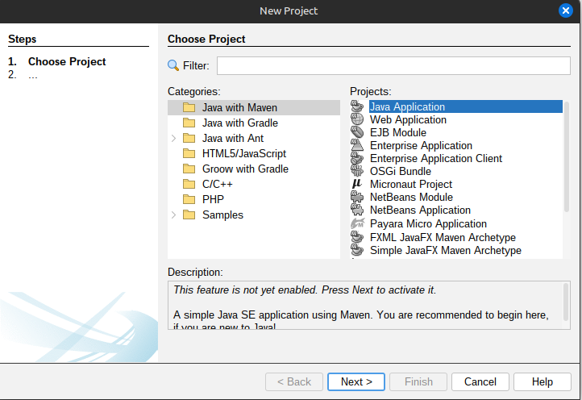

Creación del proyecto

---

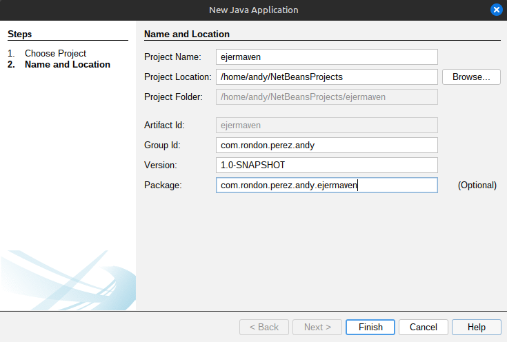

Configuración del proyecto

---

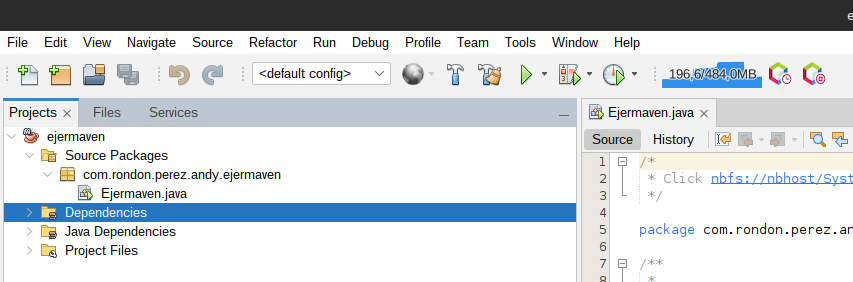

Acciones a realizar desde la barra de herramientas
