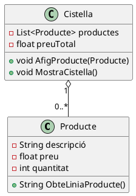

# Prueba

```plantuml
@startuml
class Producte {
    -String descripció
    -float preu
    -int quantitat
    +String ObteLiniaProducte()
}

class Cistella {
    -List<Producte> productes
    -float preuTotal
    +void AfigProducte(Producte)
    +void MostraCistella()
}

Cistella "1" o-- "0..*" Producte
@enduml
```
